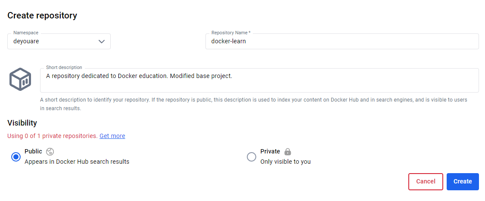

## Титул
## Вивчення Docker
## Виконав студент: Прокопенко Євгеній ІПЗ-4.04
## з дисципліни: **"Розробка та програмування координатних систем"**

## Розгортання проєкта

#### 1. Завантаження навчального проєкта

Використовуючи наступну git команду у терміналі, було завантажено репозиторій проєкта-приклада 
<br>

> git clone https://github.com/docker/getting-started-todo-app

та перехід до завантаженої папки

> cd getting-started-todo-app

**Структура завантаженої папки:** 


#### 2. Компонування проєкту у Docker

Команда консолі:
> docker compose watch

**Перевірка сайту за адресою `http://localhost`:**


## Внесення змін до проєкту

#### 1. Внесення змін до проєкту

На головній сторінці сайту є загаловок, виконаємо зміну коду в файлі `backend/src/routes/getGreeting.js`, який відповідає за передачу привітального заголовка. Зараз це один рядок на англійській мові, змінемо це — встановимо декілька варіантів на різних мовах!

Код у `backend/src/routes/getGreeting.js` до:
```javascript
const GREETING = 'Hello world!';

module.exports = async (req, res) => {
    res.send({
        greeting: GREETING,
    });
};
```

Код у `backend/src/routes/getGreeting.js` після:

```javascript
const GREETINGS = [
    "Ласкаво просимо!",
    "Welcome!",
    "Bienvenue!",
    "Yōkoso!",
    "Huānyíng!",
];

module.exports = async (req, res) => {
    res.send({
        greeting: GREETINGS[ Math.floor( Math.random() * GREETINGS.length )],
    });
};
```

Змінемо текст запрошення додати новий елемент `No items yet! Add one above!` у список, редагуючи файл `client/src/components/TodoListCard.jsx`:

До:

```javascript
<p className="text-center">No items yet! Add one above!</p>
```

Після:

```javascript
<p className="text-center"> Усі завдання виконані! Бажаєте додати нове завдання? </p>
```

Змінемо текст плейсхолдеру `New Item` та кнопки `Adding...` та `Add Item` до поля для додання нового елемента у список, редагуючи файл `client/src/components/AddNewItemForm.jsx`:

До:

```javascript
<Form.Control
    value={newItem}
    onChange={(e) => setNewItem(e.target.value)}
    type="text"
    placeholder="New Item"
    aria-label="New item"
/>
// Певний код
{submitting ? 'Adding...' : 'Add Item'}
```

Після:

```javascript
<Form.Control
    value={newItem}
    onChange={(e) => setNewItem(e.target.value)}
    type="text"
    placeholder="Що бажаєте додати?"
    aria-label="New item"
/>
// Певний код
{submitting ? 'Додання...' : 'Додати'}
```

#### 2. Перевірка змін

Запустимо композицію у консолі:
> docker compose watch

**Перейдемо на сайт `http://localhost`:**


Як можна побачити, кожного разу при оновленні сторінки користувач отримуює різне привітання, а більша частина інтерфейсу украінізована.

## Публікація в DockerHub

#### 1. Створимо публічний репозиторій на сайті `https://hub.docker.com` з назвою `docker-learn`:



#### 2. Виконаємо будування докер проєкту.

Команда у консолі:

> docker build -t deyouare/docker-learn .

Перевіримо наявність репозиторію:

> $ docker image ls

**Результат:**


#### 3. Виконаємо передачу проєкта у DockerHub.

Команда у консолі:

> docker push deyouare/docker-learn

Відкриємо сайт `https://hub.docker.com` та перевіримо репозиторій `docker-learn`:


**Як можна побачити, проект успішно завантажився у DockerHub.**

## Висновок

Docker — це інструмент для контейнеризації, який дозволяє ізолювати програми з усіма необхідними до них залежностями. Він потрібен для забезпечення стабільної роботи програм у різних середовищах, спрощення розгортання, а також для полегшення масштабованості та гнучкості розробки. Docker корисний тим, що дозволяє уникати проблем, пов'язаних з несумісністю версій та залежностей, це значно спрощує роботу над багатокомпонентними системами.

У ході виконання цієї роботи я підтвердив теоретичний матеріал з теми контейнеризації, а саме: ознайомився з основами створення, будування та публікації проєктів засобами Docker.

Під час виконання роботи, зазначена тема була закріплена через модифікування базового проєкту з використанням Docker, його перевірка, будування та публікація.

Отриманні знання та навички являють собою основу при розробці, контейнеризації та розгортанні складних програмних систем за допомоги засобів Docker.